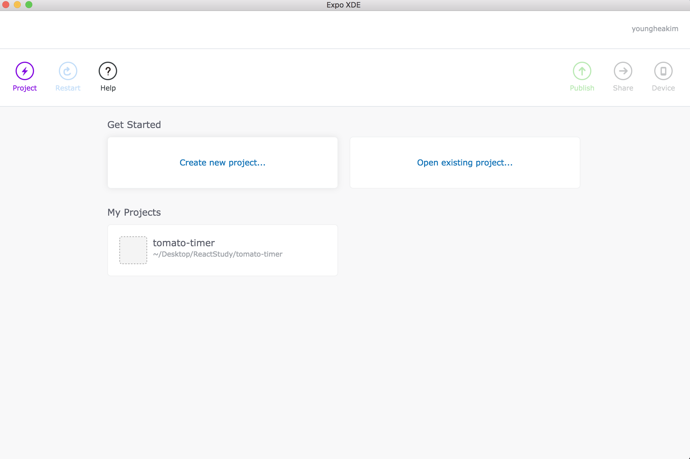
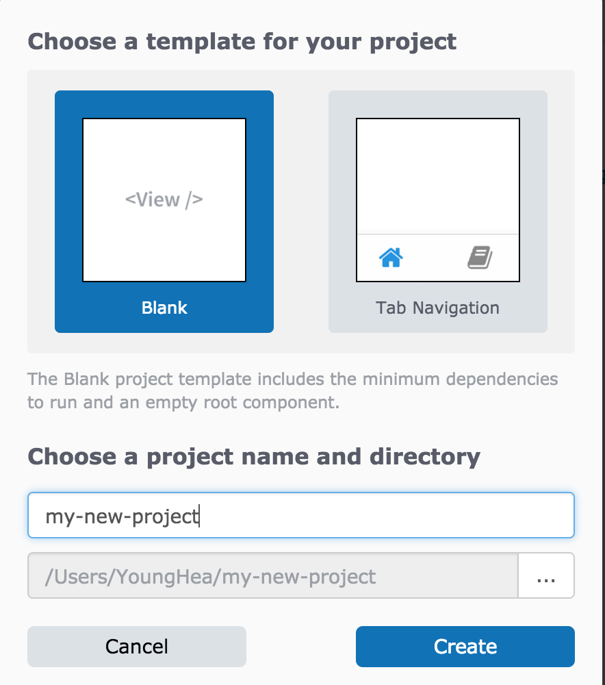
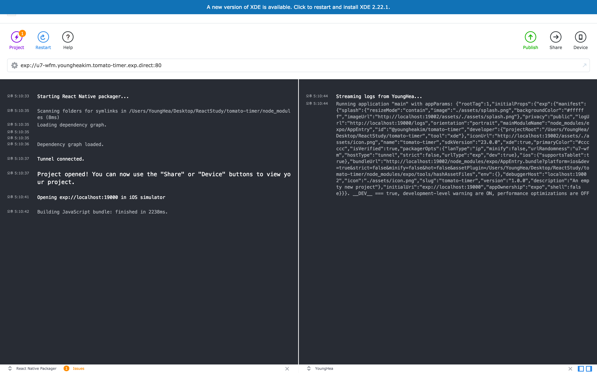
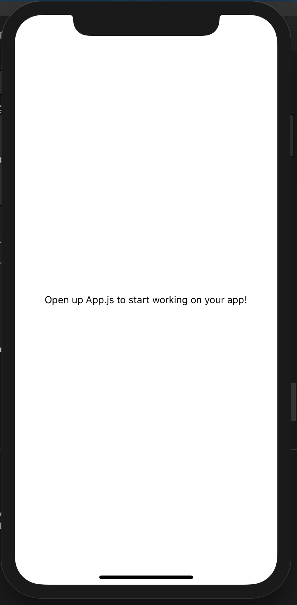

# React

title과 poster 값을 숫자나 true or false로 반환되는 되지 않고 `string`으로 출력하는 코드  
`isRequired`를 사용하면 어떤것이 빠졌는지에 대해 콘솔에서 보여준다.  
```js
static propTypes = {
  title: PropTypes.string.isRequired,
  poster: PropTypes.string.isRequired
}
```

## Render와 Update의 순서
```js
Render: componentWillMount() -> render() -> componentDidMount()
Update: componentWillReceiveProps() -> shouldComponentUpdate() -> componentWillUpdate() -> render() -> componentDidMount()
```

movies라는 variable 데이터를 저장하는 코드  
_를 붙인 이유는 리엑트 자체 기능과 내가 만든 기능의 차이를 두기 위해 내가 만든 기능 이름앞에 _를 붙인다.  
```js
_renderMovies = () => {
  const movies = this.state.movies.map((movie, index) => {
    return <Movie title = {movie.title} poster = {movie.poster} key = {index}/>
  })
  return movies
}
```

## Smart State & Dumb State
Smart State는 state가 있다.  
Dumb State는 State가 없고 Stateless라고도 부르고 functional component이다. 특징은 state가 없고 props밖에 없다.

```js
// Smart State
class MoviePoster extends Component {

  static propTypes = {
    poster: PropTypes.string.isRequired
  }

  render() {
    return (
      
    )
  }
}

// Dumb State
function MoviePoster({poster}){
  return (
    
  )
}
```
위의 코드에서 두개의 코드는 같은 작동을 하지만 차이점은 Dumb State는 Update와 ComponentWillMount와 ComponentDidMount가 필요가 없다. 그냥 한개의 props와 한개의 html파일만 있으면 된다.  
위의 경우 Dumb State를 사용하는 것이 더 적은 양의 코드를 작성하는 것이기 때문에 Dumb State를 사용하여도 된다.  

## Ajax
사용하는 이유는 뭔가를 불러올 때 페이지를 새로고침하지 않고 로딩을 하며 API를 불러오기 떄문이다.  

## 동가와 비동기
동기는 먼저있는 코드가 실행되지 않고 나서는 다음 코드가 실행되지 않는다.  
동기보다는 비동기를 사용하는 것이 더 좋다. 그 이유는 두개의 database에서 동시에 data를 불러올 때 두가지를 한번에 실행을 해야하기 때문에 비동기를 사용하여야 한다.  

## Async Await in React

만약 밑에와 같은 코드가 있으면 `this.setState`부터는 `_callApi`가 실행이 완료되기 전까지는 실행이 되지않는 동기식으로 변화를 시켜줄 수 있다.  
```js
_getMovies = async () => {
  // await란 무엇인가 리턴할 때 해당되는 모든 것의 데이터를 movies에 저장할 때 사용한다.
  // _callApi 함수가 실행되기 전까지는 다음 문장이 실행되지 않는다.
  const movies = await this._callApi()
  this.setState({
    movies 
  })
}
```

## react-lines-ellipsis
react-lines-ellipsis를 설치할때는 npm대신에 yarn을 사용하여야 한다.  

- - -
# Timer만들기

## Expo XDE를 사용하여 기본 파일 만들기
밑의 사진에서 create new project를 눌러 밑의 창이 뜨면 my-new-project부분에 원하는 이름을 적고 create를 눌러주면 기본적인 파일들을 생성해준다.  



그후 해당 폴더를 visual-studio에 열어주면 파일들을 열 수 있다.  
그리고 Xcode에서는 파일을 오픈해준 후에 밑의 창이 뜨면 오른쪽 상단에 있는 Device를 누른 후 mac에서는 mac ios를 눌러주고 윈도우의 경우에는 android를 클릭하여 실행을 시켜준다.  

밑의 창이 띄워지면 기본세팅은 완료된 것이다.  


## TIMER에 관한 컴포넌트 생성
해당 폴더안에서 Components파일을 생성 후 폴더안에 Timer라는 폴더를 생성해주고 그 후에 안에 index.js를 만들어 준다.  
index.js안에 리엑트를 연결시켜준 후 안에서 CSS까지 가능하도록 작성을 하여준다.  

## BUTTON에 관한 컴포넌트 생성
버튼 컴포넌트는 state가 없는 stateless컴포넌트이다.  
button을 위한 컴포넌트파일 안에 새로운 button이라는 파일을 만든 후 timer와 똑같이 index.js를 만들어 작성하여 준다.  
index.js에 대한 작성이 끝나면 Timer폴더안에 있는 index.js에 밑의 명령어를 작성 후에 원하는 곳에 `<Button />`을 사용하여 주면 된다.  
이떄 원하는 Button아이콘을 찾을 수 있는데 이것은 [vector-icons](https://expo.github.io/vector-icons/)에 가면 찾을 수 있다.  
```js
import Button from '../Button';
```

### `TouchableOpacity`란?
해당 버튼과 같은 것을 눌렀을 때 투명도를 증가시켜 투명해지게 만드는 명령어이다.  
반대로는 `TouchableHighlight`라는 명령어도 있다. 이 명령어는 버튼과 같은 것을 눌렀을 때 더 밝아지게 만드는 효과를 낼 수 있다.  
또 `TouchableWithoutFeedback`라는 명령어도 있는데 이 명령어는 아무 효과를 없게 하고싶을 때 사용한다.  

이때 주의 사항이 있다. 아이폰에서는 버튼을 누를 때 `TouchableOpacity`가 작동하는 것이 아니라 땔 떄 작동하기 때문에 주의해야한다.  
그리고 사용법은 아래와 같다.  
```js
<TouchableOpacity onPressOut={onPress} >
  <FontAwesome name = {iconName} size = {80} color = "white" />
</TouchableOpacity>
```
위와 같이 작성 후 실제 버튼이 들어가는 곳에 아래와 같이 onPress가 되었을 때 함수를 적어주면 작동을 한다. 실험으로 alert를 띄워보았다. 단 위의 코드에서 `TouchableOpacity`를 작성하면 해당 괄호안에 `onPress`라는 함수를 적어주어야 한다.  
```js
<Button iconName="stop-circle" onPress={ () => alert("It works!")}/> 
```

- - -
# 위에서 만들었던 timer를 redux화 시키기

## redux설치
`npm install redux react-redux --save`로 redux를 설치하여준다.  
이때 두가지를 설치하는데 `redux`와 `react-redux`를 설치하여 준다.  

## redux란?
readux는 state management of react라는 의미를 가지고 있다.  
redux를 사용하는 이유는 컴포넌트는 local state이지만 app은 global state이다. 이 때, 두가지의 state에서 공유해야할 경우 해당 state를 저장할 곳이 필요한데 공유할 state를 저장하는 방법을 redux라 한다.  
redux의 역할은 global shared state를 저장하는 것이다. 또한 redux는 state를 저장하는 state 컨테이너라고도 부른다.   
리덕스는 redux만의 DB를 갖는 것과 비슷하다. redux에 저장되어 있는 것들중 원하는 정보들만을 불러올 수 있다.  
state에 저장되어 있는 모든 것은 object로 저장이 된다.  
어떠한 정보를 가져와 reduce가 그 정보를 object화하여 state에 저장을 한 후 저장한 정보를 불러와 사용하는 것을 redux라 한다.  
redux는 react에만 사용가능한 언어가 아니라 js, jquery등 다양한 언어와 같이 사용이 가능하다.  

## redux 사용순서
1. 원하는 것을 import하여 불러온다.
2. Action들을 정의한다.  
```js
const START_TIMER = 'START_TIMER';
const RESTART_TIMER = 'RESTART_TIMER';
const ADD_SECOND = 'ADD_SECOND';
```
3. Action의 Creater들을 정의한다.
```js
function startTimer() {
  return {
    type: START_TIMER
  }
}
function restartTimer() {
  return {
    type: RESTART_TIMER
  }
}
function addSecond() {
  return {
    type: ADD_SECOND
  }
}
```
4. Reducer를 정의한다.
```js
const TIME_DURATION = 1500;

const initialState = {
  isPlaying: false,
  elapsedTime: 0,
  timerDuration: TIME_DURATION
}

function reducer(state = initialState, action) {
  switch(action.type){
    case START_TIMER:
      return applyStartTimer(state);
    case RESTART_TIMER:
      return applyRestartTimer(state);
    case ADD_SECOND:
      return applyAddSecond(stete);
  }
}
```
5. Reducer의 함수를 정의한다.
```js
function applyStartTimer(state) {
  return {
    ...state,
    isPlaying: true
  };
}
```
6. Export Action Creators
밑에와 같이 사용하는 이유는 앱에서도 사용하여야 하기 위해서 사용을 한다.  
밑에서 사용하는 함수들은 버튼에서 사용하는 함수이다.  
```js
const actionCreators = {
  startTimer,
  restartTimer,
  addSecond
}
```
7. Export Reducer
```js
export default reducer;
```

## switch와 case
swith와 case구문은 if와 else if와 비슷하게 사용이 가능하다.  
밑에와 같이 사용이 가능하다.  
```js
function greet(lang) {
  switch(lang) {
    case 'korean':
      return '안녕';
    case 'spanish':
      return 'hola';
    case 'greek':
      return 'giazu';
    case 'chinese':
      return 'nihao';
    case 'english':
      return 'hi';
    default:
      return 'dont know'
  }
}
```

## ...state의 의미
밑의 코드에서 ...state의 의미는 현재의 코드상태를 새로운 코드상태가 덮어씌운다는 의미가 들어있다.  
```js
function applyStartTimer(state) {
  return {
    ...state,
    isPlaying: true
  };
}
```

##  reducer를 실제 앱에서 연결하는 방법
provider를 사용하는 이유는 리듀서와 앱의 state를 복사하고 우리의 컴포넌트로 복사하여 사용할 수 있도록 하기 위해서이다.  
```js
import { Provider } from 'react-redux';
```
Provider의 역할은 스토어를 복사하여 자신의 칠드런 컴포넌트에 넣는 것이다.  

## 새로운 timer폴더 안에 presenter.js를 생성
새로 생성하는 이유는 presenter.js에는 state 혹은 redux작업을 하지않고 index.js에서 redux작업을 한다.  
presenter.js에서 데이터를 보여주는 것을 관리한다.  
그리고 index.js에서는 가져온 state를 관리한다.  

## presenter.js에 해야할 일
1. connect라는 것을 import로 불러온다.
- connect는 나의 컴포넌트를 스토어에 연결하는 것을 도와준다.  
```js
import { connect } from 'react-redux';
```

2. timer폴더를 연결시켜준다.
```js
import Timer from './presenter';
```

3. presenter에서도 버튼을 플레이할 때만 보여줄 수 있게 만들어준다.  
```js
{ !isPlaying ? <Button iconName="play-circle" onPress={ () => alert("It works!")}/> : null }
```
위에서 사용하는 것을 좀더 짧게 사용할 수 있는데 이것은 밑에 코드와 같이 사용이 가능하다.  
```js
{ !isPlaying && <Button iconName="play-circle" onPress={ () => alert("It works!")}/>}
```

### 왜 presenter.js에서 this.props를 사용하느냐?
index.js에서 state를 골라서 이기 때문이다.  

## redux에서 bind action creators를 불러온다.
bind action creators는 action creators를 한번에 묶어준다.  
bind할 두개는 dispatch와 액션을 묶어준다.  

## dispatch의 역할
디스패치의 역할은 액션을 reducer로 보내는 함수이다.  

## interval 함수란
interval함수는 초가 지나면 실행되는 함수이다.  
```js
const interval = setInteval(function() {
  console.log('hello')
}, 1000)
clearInterval(interval);
```
위의 함수는 예시인대 1초마다 hello를 찍는 함수이다.  
`crearInterval`을 하면 interval이 멈춘다.  

## componentWillReceiveProps란?
새로운 컴포넌트를 불러올 때마다 컴포넌트를 불러오는 함수를 말한다.   
